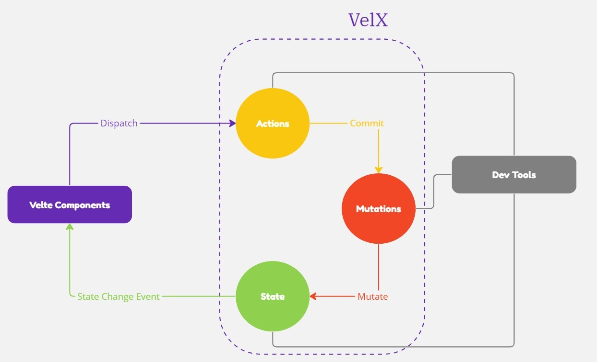

import StateViewActions from './img/state-view-actions.png';


# What is VelX?
VelX is an **event driven proxy state management pattern** for Velte applications. It serves as a centralized store for all the components in an application, with rules ensuring that the state can only be mutated in a predictable fashion.

## What is a "State Management Pattern"?

Let's start with a simple Velte counter app:

```js title="global.js"
import { velX } from "velte"

const global = new velX({
    state: {
        count : 0
    },
    actions : {
        increment(context) {
            context.commit('increment')
        }
    },
    mutations: {
        increment(state) {
            state.count = state.count + 1
            return state
        }
    }
})

export default global
```

It is a self-contained app with the following parts:

- The **state**, the source of truth that drives our app;
- The **view**, a declarative mapping of the **state**;
- The **actions**, the possible ways the state could change through mutations in reaction to user inputs from the **view**.

This is a simple representation of the concept of "one-way data flow":

<p align="center">


</p>

However, the simplicity quickly breaks down when we have **multiple components that share a common state**:

- Multiple views may depend on the same piece of state.
- Actions from different views may need to commit mutatations on the same piece of state.

For problem one, passing props can be tedious for deeply nested components, and simply doesn't work for sibling components. For problem two, we often find ourselves resorting to solutions such as reaching for direct parent/child instance references or trying to mutate and synchronize multiple copies of the state via events. Both of these patterns are brittle and quickly lead to unmaintainable code.

So why don't we extract the shared state out of the components, and manage it in a global singleton? With this, our component tree becomes a big "view", and any component can access the state or trigger actions, no matter where they are in the tree!

By defining and separating the concepts involved in state management and enforcing rules that maintain independence between views and states, we give our code more structure and maintainability.

This is the basic idea behind VelX, is inspired by [Vuex](https://vuex.vuejs.org/), [Redux](http://redux.js.org/) and [The Elm Architecture](https://guide.elm-lang.org/architecture/). Unlike the other patterns.

<p align="center">



</p>

## Publish / Subscribe Pattern

VelX is event driven, and was built with the [Pub/Sub pattern](https://learn.microsoft.com/en-us/previous-versions/msdn10/hh201955(v=msdn.10)) under the hood.
It's fairly simple, a VelX instance, contains two main methods, one that will call our actions named `dispatch` and another that will call our mutations called `commit`.
Then on state change, an Event called `stateChange` will be published to our entire application, and any Velte component subscribed to that named event would re-evaluate, and trigger associated DOM updates.
This is done for performance optimizations, so static components would run unnessasary evaluations.

## When Should I Use It?

VelX helps us deal with shared state management with the cost of more concepts and boilerplate. It's a trade-off between short term and long term productivity.

If you've never built a large-scale SPA and jump right into using VelX, it may feel verbose and daunting. That's perfectly normal - if your app is simple, you will most likely be fine without VelX. A simple [store pattern](../misc/states.md) may be all you need. But if you are building a medium-to-large-scale SPA, chances are you have run into situations that make you think about how to better handle state outside of your Velte components, and VelX will be a no brainer for you.