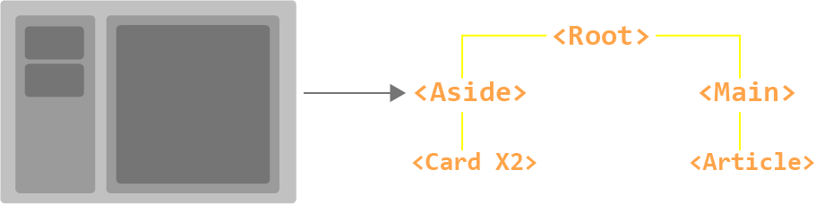
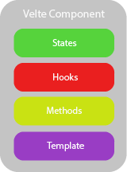
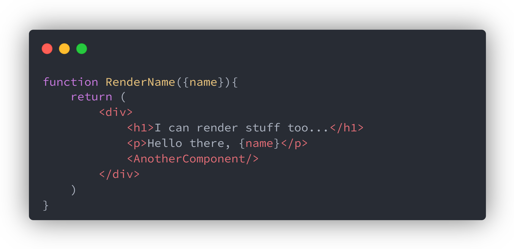
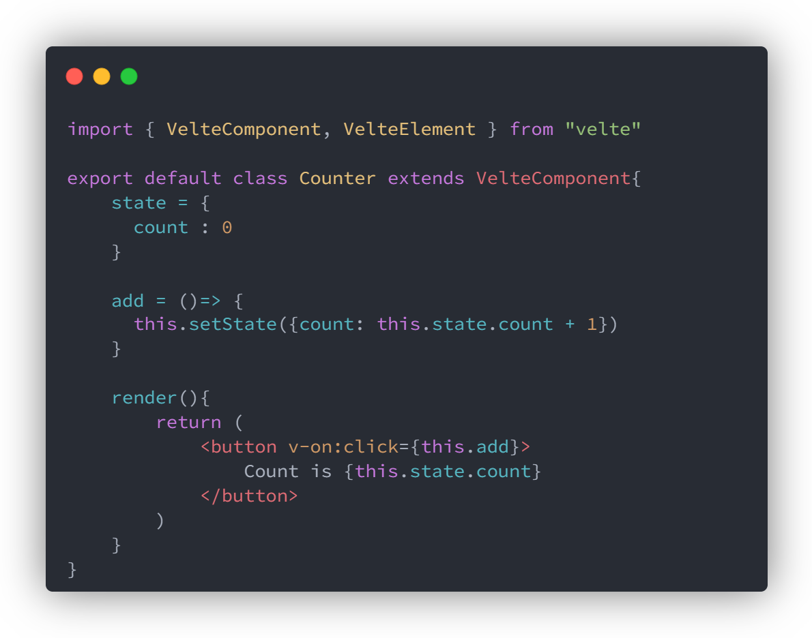

# Velte components

:::tip
 You should always import `VelteElement` and `VelteComponent` from `velte` when using velte components.
:::

Comonents allows us to split the UI into independent and reusable pieces. It's common for an app to be organised into a tree of nested components.<br/>
Velte supports [`function components`](./basics.md#functional-components) and [`class components`](./basics.md#class-components)




:::info
 In velte, every component is made up of custom content and functionality.
:::


<p align="center">



</p>

From the diagram above, every velte component is made up of `states`, `hooks`, `methods`, and `templates`

## Calling Components

Calling components is just like calling a HTML element like ``

```jsx
const App = <MyComponent/>
```

`MyComponent` is the name of the component.

## Functional Components

<p align="center">



</p>

These components are created with `functions`. 

```jsx title="functionComponent.jsx"
function functionComponent({name}){
    return (
        <div>
            <h1>I can render stuff too...</h1>
            <p>Hello there, {name}</p>
            <AnotherComponent/>
        </div>
    )
}
```
```jsx title="anotherFunctionComponent.jsx"
const anotherFunctionComponent = ({age})=>{
    return (
        <div>
            <h1>I can also render stuff too...</h1>
            <p>Your age is {age}</p>
            <functionComponent/>
        </div>
    )
}
```

Function components only accept [traits](essentials/traits.md#data-trait) and return JSX for rendering. <br/>They can be used as [`root components`](essentials/application.md#the-root-component)

## Class Components

<p align="center">



</p>

These components extends `VelteComponent`, so they inherit all the methods of the base `VelteComponent` from `velte`.

:::caution
 class component names must always start with a capital letter, its still a class afterall.
:::

## Inherited Functionality

### `constructor()`

The `constructor()` is powerful in velte components.<br/> 
They can define [`states`](./basics.md#component-states) and component [`methods`](./basics.md#component-methods). They also add [`data traits`](../essentials/traits.md#data-trait) functionality to class components.

```js title="classComponent.jsx"
//inside class component
...
constructor(){
    //define states
    this.state = {
        data : 0
    }
    //define methods
    this.increment = () =>{
        this.setState({count: this.state.count + 1})
    }
}
...
```

### `render()`

The `render()` method inherits from `VelteComponent`.<br/>
This method returns JSX to be rendered.

```jsx title="classComponent.jsx"
//inside class component
...
render(){
    return(
        <p>Hello velte</p>
    )
}

```
### `onCreated()`

For details, [see guide here](../essentials/hooks.md#oncreated)

### `onBeforeMounted()`

For details, [See guide here](../essentials/hooks.md#onbeforemount)

### `onMounted()`

For details, [See guide here](../essentials/hooks.md#onmounted)

### `onBeforeUpdate()`

For details, [See guide here](../essentials/hooks.md#onbeforeupdate)

### `onUpdated()`

For details, [See guide here](../essentials/hooks.md#onupdated)

### `onBeforeUnmount()`

For details, [See guide here](../essentials/hooks.md#onbeforeunmount)

### `onUnmounted()`

For details, [See guide here](../essentials/hooks.md#onunmounted)

## Component States

How do we store data in a component? with `states`!!!<br/>
states help store data for use in a component, this can be for displaying information or using the data to perform calculations or sending requests to servers...

```js title="classComponent.jsx"
//inside class component constructor
...
this.state = {
    data : value
}
```
```js title="classComponent.jsx"
//inside class component
...
state = {
    data : value
}
```
Think of states like a local store for variables, where `data` is the name of the variable and `value` is the variable value.

```js title="classComponent.jsx"
//inside class component constructor
...
this.state = {
    name : "Joe",
    age : 23
}
```
```js title="classComponent.jsx"
//inside class component
...
state = {
    name : "Joe",
    age : 23
}
```
:::note
 `states` can also contain objects.
:::

```js title="classComponent.jsx"
//inside class component constructor
...
this.state = {
    person : {name : "Joe", age : 23}
}
```

```js title="classComponent.jsx"
//inside class component
...
state = {
    person : {name : "Joe", age : 23}
}
```

### `setState()`

To update a state variable we use `setState()` method inside class components.

```jsx title="Counter.jsx"
export class Counter extends VelteComponent{
    state = {
        count : 0
    }

    increment = () =>{
         this.setState({count: this.state.count + 1})
    }

    render(){
        return(
            <div>
                <p>{this.state.count}</p>
                <button v-on:click = {this.increment}>Increment</button>
            <div>
        )
    }
}
```
:::note
`this.state.count` accesses the count variable inside the "state store".
:::

:::note
 `this` is called before accessing the different methods because we use `this` to reference the current component instance.
:::

:::info
 For scalability, your components would live in another folder `components` if using a [`starter kit`](../get-started.md#starter-kit). You would have to export the component by adding the `export` keyword.
:::

## Component Lifecycle Hooks

What if I want to perform various functions during the lifecycle of my components.<br/>

You can, `velte` supports different `hooks` that run during the lifecycle of your components

For details, [see guide here](../essentials/hooks.md)


## Component Methods

Methods are functions in classes, used to perform a certain grouped task without repeating code.<br/>
In `velte class components` methods do the exact same thing. Methods in `velte` live in the `constructor()` function or the `class` body.

```js title="classComponent.jsx"
//inside class component
...
constructor(...){
    ...
    //methods go here
}
```

```js title="classComponent.jsx"
class ClassComponent extends VelteComponent{
    //methods go here
}
```

Using methods inside a class component :

```jsx title="Greet.jsx"
export class Greet extends VelteComponent{
    constructor(){
        this.state = {
            show : true
        }
        //this is a method inside the constructor
        this.display = () =>{
            return <p>Greetings Friend!!!</p>
        }
    }
    
    //this is a method inside the main body
    greet = () =>{
        return <p>Hello</p>
    }

    render(){
        return(
            <div>
                <If condition={this.state.show}>
                    {this.display}
                </If>
                {this.greet}
            <div>
        )
    }
}
```

### Method Parameters and Arguments

When declaring a method, you can pass in parameters just like a `Javascript` function.<br/>

When calling the method, you can pass arguments for the required parameters just like calling a `Javascript` function.

```jsx title="Binding.jsx"
export class Binding extends VelteComponent{
    constructor(){
        this.state = {
            message : "Hey dude!"
        }

        this.handleChange = (event) => {
            event.preventDefault()
            variableValue = event.target.value
        }
    }

    render(){
        return(
            <div>
                <p>{this.state.message}</p>
                <input name="message" value = {this.state.message} v-on:change={this.handleChange}/>
            </div>
        )
    }
}
```
## Component Template

Velte uses [JSX](../essentials/syntax.md#jsx) for templating, meaning you structure how your UI looks with JSX.<br/>

In class components, you return JSX inside the `render()` method. This would render the snippet of JSX in your component when [called](./basics.md#calling-components).

```jsx title="classComponent.jsx"
//inside a class component
...
render(){
    return(
        <p>Hello, from the render method</p>
    )
}
```

## Component Nesting

Components can be nested into other components by calling them. The nested components are called `child components` and host component that houses the nested components are called `parent components`

```jsx title="childClassComponent.jsx"

//inside child class component
...
render(){
    return(
        <div>
            <p>Child Component</p>
        </div>
    )
}
```

```jsx title="parentClassComponent.jsx"

//inside parent class component
...
render(){
    return(
        <div>
            <p>Parent component</p>
            <ChildComponent/>
        </div>
    )
}
```
