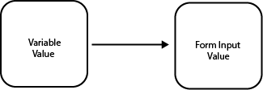
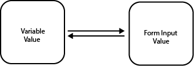

# Form input Binding

You can bind form input [traits](./traits.md#traits) like `value` to variables. When this is done, the value of the variable would be assigned to form input trait.

## One - way data binding

This is binding the value of a variable to the value of the form input. If the varaible changes the value of the form input changes too. But if the form input value changes first, the variable value will **NOT** change. So the relationship here is `one-way data binding`

<p align="center">



</p>

## How to implement this in velte?

```jsx
//one-way data binding in velte

const variableValue = "Velte is ok-ish, right?"
const App = (<input name="message" value = {variableValue}/>)
```

## Two - way data binding

This is binding the value of a variable to the value of the form input and vice-versa. If the variable value changes the form input value also changes and if the value of the form input changes, the variable value changes too. So the relationship here is `two-way data binding`

:::info
 In velte, two-way data binding is acomplished using the [`v-on:change`](./events.md) event trait.
:::

<p align="center">



</p>

```jsx
//two-way data binding in velte

const variableValue = "Velte is awesome"

function handleChange(e){
    e.preventDefault()
    variableValue = e.target.value
}

const App = (
    <div>
        <p>{variableValue}</p>
        <input name="message" value = {variableValue} v-on:change={handleChange()}/>
    </div>
)
```