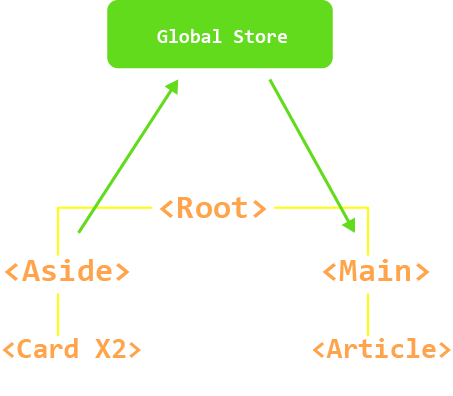

# State Managment

Every velte component instance already "manages" its own reactive state. Take a simple counter component as an example:

```jsx title="Counter.jsx"
export class Counter extends VelteComponent{
    state = {
        count : 0
    }

    increment = () =>{
        this.setState({count: this.state.count + 1})
    }

    render(){
        return(
            <div>
                <p>{this.state.count}</p>
                <button v-on:click = {this.increment}>Increment</button>
            </div>
        )
    }
}
```

It is a self-contained unit with the following parts:

- The state, the source of truth that drives our app;
- The view, a declarative mapping of the state;
- The actions, the possible ways the state could change in reaction to user inputs from the view.

However, the simplicity starts to break down when we have multiple components that share a common state:

A possible workaround is by "lifting" the shared state up to a common ancestor component, and then pass it down as traits. However, this quickly gets tedious in component trees with deep hierarchies, leading to another problem known as Trait Punching.

A simpler and more straightforward solution is to extract the shared state out of the components, and manage it in a global singleton.

:::info
 Use [`VelX`](../velx/intro.mdx), an event driven proxy managment solution to build your Velte applications.
:::


## Trait Punching

Usually, when we need to pass data from the parent to a child component, we use traits. However, imagine the case where we have a large component tree, and a deeply nested component needs something from a distant ancestor component. With only traits, we would have to pass the same prop across the entire parent chain:

<p align="center">


</p>


What if `<card>` was to give data to `<article>`, you would have to store the data in a variable inside `<root>`, so it can be passed as a trait to `<article>`

Global stores can fix this problem.

<p align="center">



</p>

`global store` holds the data passed from `<card>` to `<article>`

The `global store` holds data for your application instance and can be passed into components without punching the traits.